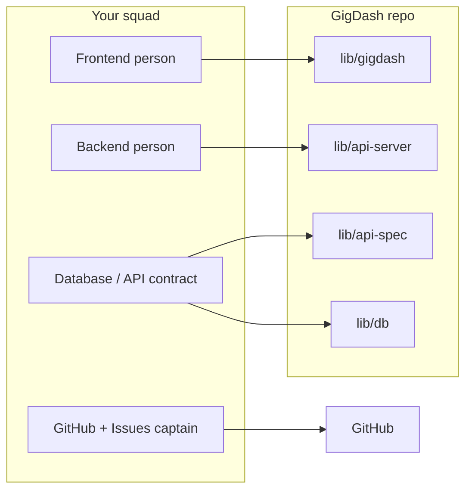

# GigDash Team Docs

> **Live music, one dashboard.** Artists find gigs. Venues book talent. Fans discover shows on a map.

Welcome to the GigDash documentation hub. These guides are written for high school comp sci teams: clear language, real examples from *this* repo, and a focus on **building together** with AI and GitHub.

---

## How to read these docs in VS Code

1. Open this folder in **VS Code** (or Cursor).
2. When prompted, click **Install Recommended Extensions** (Markdown + Mermaid + GitHub tools).
3. Open any file in `docs/`.
4. Press **`Ctrl + Shift + V`** (Windows) or **`Cmd + Shift + V`** (Mac) to open **Markdown Preview**.
5. For side-by-side editing: **`Ctrl + K`, then `V`** (Open Preview to the Side).

The preview uses a custom dark theme that matches GigDash (amber, violet, emerald accents).

---

## Documentation map

| Guide | What you'll learn |
|-------|-------------------|
| [Getting Started](./getting-started.md) | Install tools, run the app, connect to the shared database |
| [Understanding GigDash](./understanding-gigdash.md) | What the app does, how the code is organized, data flow |
| [Vibe Coding with GigDash](./vibe-coding.md) | Use AI assistants safely and effectively on this project |
| [GitHub & Team Workflow](./github-collaboration.md) | Branches, pull requests, reviews, splitting work |
| [Recipe Book](./recipe-book.md) | Step-by-step recipes for common changes |
| [Team Playbook](./team-playbook.md) | Roles, meetings, issues, demo prep |

**Legacy note:** [migration-to-github.md](./migration-to-github.md) still has the original Replit → GitHub migration checklist. The [GitHub guide](./github-collaboration.md) is the main place for day-to-day teamwork.

---

## Quick start (60 seconds)

```bash
# After cloning the repo:
pnpm install
cp .env.example .env
# Paste DATABASE_URL from your team lead into .env

pnpm dev                                       # API + frontend (separate ports)
```

Then open the URL Vite prints in the terminal (often `http://localhost:5173`).

---

## The one rule for collaboration

> **Never push directly to `main`.**  
> Always use a branch → Pull Request → review → merge.

Everything else in these docs supports that habit.

---

## Who does what? (typical team)



You do not need fixed job titles — rotate roles so everyone learns Git and the full stack.

---

## Need help?

| Problem | Where to look |
|---------|----------------|
| App won't start | [Getting Started](./getting-started.md) → Troubleshooting |
| Don't know which file to edit | [Understanding GigDash](./understanding-gigdash.md) → Project map |
| AI changed too much at once | [Vibe Coding](./vibe-coding.md) → Golden rules |
| Merge conflict | [GitHub guide](./github-collaboration.md) → Conflicts |
| "How do I add X?" | [Recipe Book](./recipe-book.md) |

---

*Built for ICS / comp sci project teams. Update these docs when you learn something the hard way — your future teammates will thank you.*