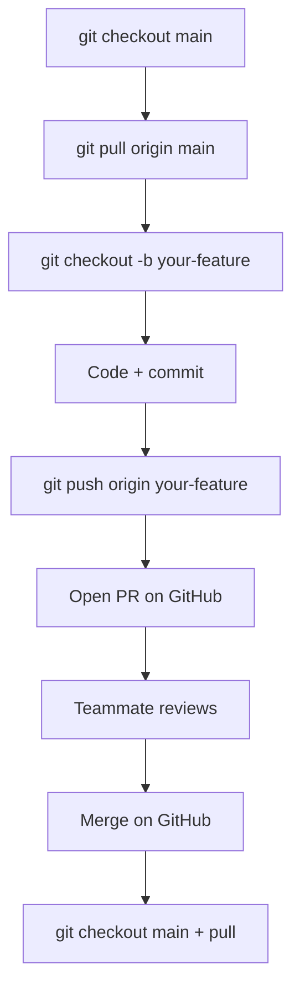

# GitHub & Team Workflow

GitHub is your team's **shared save file** with a built-in "please review my homework" button. That button is called a **Pull Request (PR)**.

This guide covers everyday teamwork on GigDash. For the first-time Replit → GitHub migration checklist, see also [migration-to-github.md](./migration-to-github.md).

---

## The golden rule

> **Nobody commits directly to `main`.**  
> Branch → commit → push → Pull Request → review → merge → pull `main`.

`main` should always run well enough to demo. Broken experiments live on branches.

---

## Git vocabulary (60 seconds)

| Term | Plain English | GigDash example |
|------|---------------|-----------------|
| **Repository** | Project folder + history | `github.com/yourteam/gigdash` |
| **Branch** | Parallel copy for one task | `fix-map-popup` |
| **Commit** | Saved snapshot + message | `Add genre filter to fan map` |
| **Push** | Upload commits to GitHub | `git push origin fix-map-popup` |
| **Pull** | Download teammates' work | `git pull origin main` |
| **Pull Request** | Ask to merge your branch | "Please review my fan filter" |
| **Merge** | Combine branch into `main` | After approval |
| **Conflict** | Same line edited twice | Two people edited `FanHome.tsx` |

---

## Team setup (do once)

### Protect `main`

Repo **Settings → Branches → Add rule**:

- Branch name: `main`
- Require a pull request before merging
- Require 1 approval (or 2 for larger teams)

### Add collaborators

**Settings → Collaborators** — invite each GitHub username.

### Shared database secret

One person creates [Neon](https://neon.tech) and shares `DATABASE_URL` securely (class chat is OK; public repo is not).

- Local / Replit: `.env` or Replit Secrets
- Never commit `.env`

---

## Daily workflow



### Morning script

```bash
git checkout main
git pull origin main
pnpm install
```

### Start a feature

```bash
git checkout -b add-venue-rating
```

**Branch naming:**

| Prefix | Use for |
|--------|---------|
| `add-` | New feature |
| `fix-` | Bug fix |
| `update-` | Improve existing feature |
| `docs-` | Documentation only |

Examples: `add-artist-dashboard`, `fix-login-redirect`, `docs-vibe-coding-guide`

### Commit often

```bash
git status
git add lib/gigdash/src/pages/FanHome.tsx
git commit -m "Add location filter debounce on fan home"
```

**Good messages (present tense, specific):**

- `Fix map marker not clearing on genre change`
- `Add GET /api/venues/:id/events to OpenAPI spec`

**Avoid:** `stuff`, `wip`, `asdf`, `final final`

### Push and open PR

```bash
git push origin add-venue-rating
```

On GitHub: **Compare & pull request**

### PR description template

```markdown
## What changed
- Short bullet list

## Why
- User story or bug report

## How to test
1. pnpm install
2. Start API + frontend
3. Go to /fan and ...

## Screenshots
(paste images for UI changes)

## Checklist
- [ ] pnpm run typecheck passes
- [ ] Tested in browser
```

### Review someone else's PR

1. Read description
2. Open **Files changed**
3. Leave line comments for questions
4. **Approve** or **Request changes**
5. Never merge your own PR if your teacher requires peer review

### After merge

```bash
git checkout main
git pull origin main
```

Delete the remote branch when GitHub offers — keeps the repo tidy.

---

## Splitting work without collisions

Use **GitHub Issues** as your task board (free, built-in).

| Area | Typical owner | Files |
|------|---------------|-------|
| Fan experience | Person A | `pages/FanHome.tsx`, `components/fan/` |
| Venue pages | Person B | `VenueProfile.tsx`, `routes/venues.ts` |
| Auth | Person C | `Auth.tsx`, `routes/auth.ts` |
| API contract | Person D | `openapi.yaml` then codegen |

**File-level rule:** If an Issue says "Fan map filters," only that person edits `FanHome.tsx` until the PR merges.

See [Team Playbook](./team-playbook.md) for sprint planning.

---

## Merge conflicts (step by step)

You see:

```text
CONFLICT (content): Merge conflict in lib/gigdash/src/pages/FanHome.tsx
```

Open the file. Git marked the fight:

```typescript
<<<<<<< HEAD
  const [selectedGenre, setSelectedGenre] = useState("All");
=======
  const [selectedGenre, setSelectedGenre] = useState("Jazz");
>>>>>>> main
```

**Fix:**

1. Decide the correct code (maybe combine both ideas).
2. Delete the `<<<<<<<`, `=======`, `>>>>>>>` lines.
3. Save.

```bash
git add lib/gigdash/src/pages/FanHome.tsx
git commit -m "Resolve merge conflict in FanHome genre default"
```

**Stuck?** Message the person who edited the other side on Slack/Discord — conflicts are normal, not failure.

---

## Replit + GitHub together

Many teams code in **Replit** but review on **GitHub**:

1. Replit sidebar → **Git**
2. Create branch (or terminal `git checkout -b ...`)
3. Commit in Git panel
4. Push
5. Open PR in browser
6. After merge → **Pull** in Replit

Same repo, two UIs. Pick what you like.

---

## VS Code + GitHub extension

Install **GitHub Pull Requests** (recommended in `.vscode/extensions.json`):

- See PRs inside VS Code
- Checkout a PR branch locally to test it
- Comment without leaving the editor

---

## Emergency: `main` is broken

1. Find the merged PR on GitHub
2. Click **Revert** → creates undo PR
3. Review and merge revert
4. Everyone `git pull origin main`
5. Fix forward on a new branch

Or: teammate who merged the bug ships a fast `fix-` PR.

---

## Releases and demos (ICS / project marks)

Tag milestones:

```bash
git tag -a v0.1-demo -m "Class demo March 2026"
git push origin v0.1-demo
```

Your PR history + Issues prove who did what — keep PRs small and descriptive.

---

## Quick reference card

```text
START:     git checkout main && git pull && pnpm install
BRANCH:    git checkout -b add-my-feature
WORK:      (edit code)
CHECK:     pnpm run typecheck
COMMIT:    git add . && git commit -m "Clear message"
PUSH:      git push origin add-my-feature
REVIEW:    Open PR → teammate approves
MERGE:     On GitHub → Merge pull request
SYNC:      git checkout main && git pull
```

---

## FAQ

**Do I need a laptop?**  
No. Replit + GitHub in the browser is enough for many teams.

**Can I push broken code to a branch?**  
Yes on a branch — but not to `main`. Don't open a PR until typecheck passes.

**I committed to `main` by accident?**  
Tell your captain immediately. They can help revert and move commits to a branch.

**How do I see what others are doing?**  
GitHub → **Pull requests** (open) and **Branches**.

---

**Next:** [Recipe Book](./recipe-book.md) — copy-paste workflows for common GigDash changes.