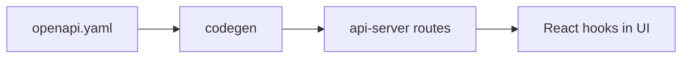

# GigDash Recipe Book

Copy these recipes when building features. Each lists **order of operations**, **files**, and **commands**.

---

## Recipe 1: Change UI on an existing page

**When:** New button, layout tweak, copy change — no new API.

| Step | Action |
|------|--------|
| 1 | Branch: `git checkout -b update-fan-filter-ui` |
| 2 | Edit `lib/gigdash/src/pages/*.tsx` or `components/` |
| 3 | Preview: `pnpm dev` or `pnpm --filter @workspace/gigdash run dev` |
| 4 | Check: `pnpm run typecheck` |
| 5 | PR with screenshot |

**AI prompt snippet:**

```text
Edit only lib/gigdash/src/pages/FanHome.tsx. [describe UI change]. Use shadcn Button and existing Tailwind tokens.
```

---

## Recipe 2: Add a new frontend page

**When:** New route like `/artist/dashboard`.

| Step | File |
|------|------|
| 1 | Create `lib/gigdash/src/pages/ArtistDashboard.tsx` |
| 2 | Register route in `lib/gigdash/src/App.tsx` |
| 3 | Add nav link in `Navbar.tsx` or role-specific nav |
| 4 | If login required, wrap with `ProtectedRoute` like `/fan` |

**App.tsx pattern:**

```tsx
<Route path="/artist">
  {() => <ProtectedRoute component={ArtistDashboard} />}
</Route>
```

---

## Recipe 3: Add a field to the database

**When:** Store new info (e.g. venue phone number).

| Step | Command / file |
|------|----------------|
| 1 | Edit table in `lib/db/src/schema/venues.ts` (or relevant file) |
| 2 | `pnpm --filter @workspace/db run push` |
| 3 | Update seed if needed: `scripts/src/seed.ts` |
| 4 | Expose field through API (Recipe 4) |

> Coordinate in Slack before `push` — everyone shares one Neon DB.

---

## Recipe 4: Add or change an API endpoint

**When:** Frontend needs new data from the server.



| Step | Action |
|------|--------|
| 1 | Edit `lib/api-spec/openapi.yaml` (paths + schemas) |
| 2 | `pnpm --filter @workspace/api-spec run codegen` |
| 3 | Implement handler in `lib/api-server/src/routes/*.ts` |
| 4 | Register router in `lib/api-server/src/routes/index.ts` if new file |
| 5 | Use generated hook in `lib/gigdash` (e.g. `useListEvents`) |
| 6 | `pnpm run typecheck` |

**Do not hand-edit** `lib/api-client-react/src/generated/api.ts`.

---

## Recipe 5: Wire frontend to existing API

**When:** Endpoint already exists in OpenAPI.

| Step | Action |
|------|--------|
| 1 | Find hook in `lib/api-client-react/src/generated/api.ts` |
| 2 | Import hook in your page |
| 3 | Handle `isLoading`, `error`, `data` (TanStack Query pattern) |

**Example pattern (from FanHome):**

```tsx
import { useListEvents } from "@workspace/api-client-react";

const { data, isLoading, error } = useListEvents({
  genre: selectedGenre !== "All" ? selectedGenre : undefined,
});
```

---

## Recipe 6: Add demo data for class

| Step | Action |
|------|--------|
| 1 | Edit `scripts/src/seed.ts` |
| 2 | `pnpm --filter @workspace/scripts run seed` |
| 3 | Confirm map/events in `/fan` |

Use fake names and emails — no real people's data.

---

## Recipe 7: Fix TypeScript errors after pulling `main`

```bash
git pull origin main
pnpm install
pnpm run typecheck
```

If errors mention `api-client-react`:

```bash
pnpm --filter @workspace/api-spec run codegen
pnpm run typecheck
```

---

## Recipe 8: Pre-demo hardening

```bash
pnpm run typecheck
pnpm run build
pnpm --filter @workspace/api-server run dev
pnpm --filter @workspace/gigdash run dev
```

Manual test script:

- [ ] Home page loads
- [ ] Signup / login works
- [ ] `/fan` shows map and events (after login as fan)
- [ ] Click venue → `/venue/:id` loads

---

## Recipe 9: Documentation-only change

| Step | Action |
|------|--------|
| 1 | Branch: `docs-update-github-guide` |
| 2 | Edit files in `docs/` |
| 3 | Preview in VS Code: `Ctrl+Shift+V` |
| 4 | PR — no typecheck required but run if you touched code |

---

## Recipe 10: OpenAPI + auth endpoint

Auth routes already exist in `lib/api-server/src/routes/auth.ts`.

To extend (e.g. password reset):

1. Add path to `openapi.yaml` under `/auth/...`
2. Codegen
3. Implement in `auth.ts` using `bcryptjs` patterns from signup
4. Update `Auth.tsx` or `AuthModal.tsx` UI

Sessions use **cookies** — frontend must use generated client (includes credentials).

---

## Conflict-prone files (claim in Issues before editing)

| File | Why |
|------|-----|
| `FanHome.tsx` | Everyone loves the map |
| `openapi.yaml` | Blocks codegen for whole team |
| `App.tsx` | Route conflicts |
| `index.css` | Global theme variables |
| `seed.ts` | Shared DB contents |

---

## Command cheat sheet

```bash
pnpm install
pnpm run typecheck
pnpm run build
pnpm dev
pnpm --filter @workspace/gigdash run dev
pnpm --filter @workspace/api-server run dev
pnpm --filter @workspace/db run push
pnpm --filter @workspace/scripts run seed
pnpm --filter @workspace/api-spec run codegen
```

---

**Next:** [Team Playbook](./team-playbook.md) — run meetings, Issues, and fair credit.