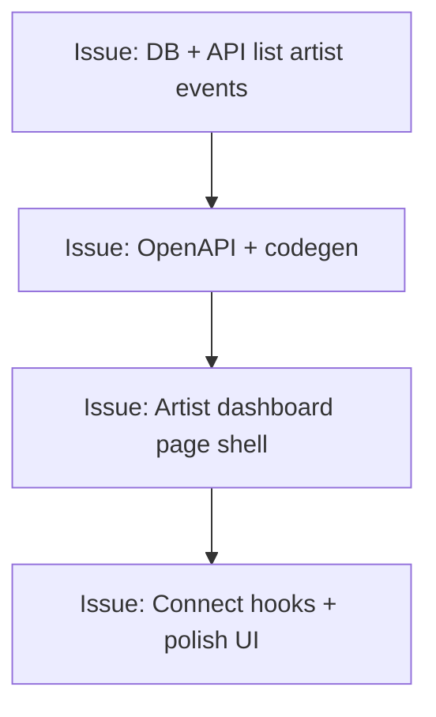

# Team Playbook

How to run a high school comp sci project like a small startup — without chaos.

---

## Recommended roles (rotate weekly)

| Role | Responsibility |
|------|----------------|
| **Captain** | Runs standup, unblocks people, owns `main` health |
| **GitHub lead** | Issues board, branch hygiene, reminds about PRs |
| **Frontend lead** | `lib/gigdash` architecture, UI consistency |
| **Backend lead** | `api-server`, `openapi.yaml`, codegen timing |
| **Docs / demo** | Screenshots, seed data, presentation script |

Everyone still commits code in every area over the semester — roles are coordination, not gates.

---

## First week checklist

- [ ] GitHub repo created, teammates invited
- [ ] Branch protection on `main`
- [ ] Neon database + `DATABASE_URL` shared securely
- [ ] Everyone cloned, `pnpm install`, app runs
- [ ] Team read [Getting Started](./getting-started.md) + [GitHub guide](./github-collaboration.md)
- [ ] Agreed on chat channel (Discord, Teams, etc.)
- [ ] Created GitHub Issues for first sprint

---

## Using GitHub Issues as your task board

**Issues** = tickets. **Labels** = categories.

Suggested labels:

| Label | Meaning |
|-------|---------|
| `frontend` | React / pages |
| `backend` | Express routes |
| `database` | Schema / seed |
| `bug` | Something broken |
| `good-first-issue` | New teammate friendly |
| `blocked` | Waiting on someone |

### Good issue title

> Fan map: add "Tonight only" date filter

### Good issue body

```markdown
**User story:** As a fan, I want to see only shows happening today.

**Files likely involved:** FanHome.tsx, maybe openapi.yaml if API needs date param

**Acceptance criteria:**
- [ ] Toggle on fan home
- [ ] Map and list both filter
- [ ] typecheck passes

**Out of scope:** Changing venue profile page
```

Assign **one assignee** per issue when possible — reduces merge conflicts.

---

## Weekly rhythm (45-minute class)

| Minutes | Activity |
|---------|------------|
| 0–5 | Standup: what I did, what today, blockers |
| 5–10 | Review open PRs on projector |
| 10–35 | Work time (branches only) |
| 35–40 | Merge approved PRs together |
| 40–45 | Update Issues, assign next tasks |

**Standup script (each person, 30 seconds):**

1. Yesterday I merged / worked on …
2. Today I will …
3. I'm blocked on … (or "nothing")

---

## Splitting a big feature (example)

**Feature:** Artist dashboard with upcoming gigs



| Issue | Owner | Depends on |
|-------|-------|------------|
| API + schema | Backend lead | — |
| Codegen + routes | Backend lead | API spec merged |
| Empty dashboard route | Frontend | — |
| Data + UI | Frontend | API merged |

Merge **bottom to top** — API before UI that needs it.

---

## Code review culture (kind, useful)

### Reviewers should ask

- Does this match fan/venue/artist colors?
- Could this be a smaller PR?
- Did they test logged-in and logged-out?
- Any secrets in the diff?

### Authors should

- Keep PRs under ~300 lines when possible
- Post screenshots for UI
- Link the Issue: `Closes #12`
- Respond to comments within 24 hours

### Phrases that help

- "Can we extract this into a component in `components/fan/`?"
- "This might need an OpenAPI change — did you run codegen?"
- "Works on my machine — can you add test steps to the PR?"

---

## Fair credit and plagiarism

- **Commit history** and **PR authors** show who wrote what.
- Using AI is fine; **hiding** that you don't understand the code is not.
- In presentations, each person explains the file they owned.

For reports, export:

- GitHub → Insights → Contributors
- Merged PR list before demo day

---

## Demo day prep

| Days before | Task |
|-------------|------|
| 7 | Feature freeze on new big ideas |
| 5 | `pnpm run build` on `main` |
| 3 | Fresh seed, test accounts documented |
| 1 | Tag release `v1.0-demo` |
| 0 | Deployed Replit URL + backup screen recording |

**Test accounts:** Document in a private class doc (not in public GitHub):

```text
fan@test.example / password from seed
```

---

## When teammates disagree

1. Talk 5 minutes in person
2. If still stuck, captain decides **or** teacher decides
3. Ship the simpler version for demo; log "phase 2" Issue

Perfect code is less important than **working demo + clear Git history**.

---

## Communication norms

| Do | Don't |
|----|-------|
| Post PR link when ready for review | "Can someone look?" with no link |
| Say which file you're editing | "I'm fixing everything" |
| Pull `main` daily | Work on week-old branch |
| Ask before `db push` on shared Neon | Surprise schema wipe |

---

## Learning goals (what your teacher probably wants)

By project end you should be able to:

- Explain client → API → database flow in GigDash
- Create a branch, PR, and handle a simple conflict
- Use AI to speed up work **and** verify the result
- Read a teammate's TypeScript without panic

---

## Links

- [Docs home](./README.md)
- [Vibe coding](./vibe-coding.md)
- [GitHub workflow](./github-collaboration.md)
- [Migration checklist](./migration-to-github.md)