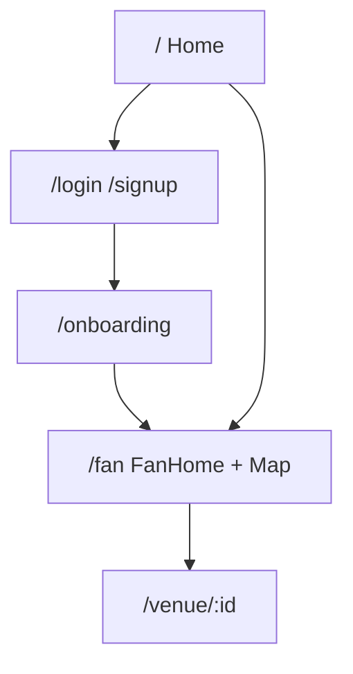
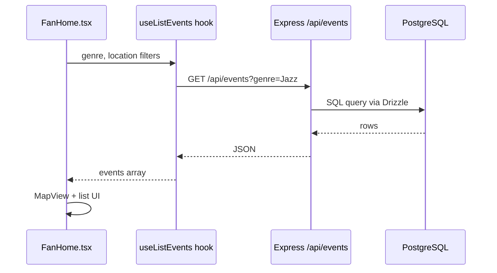

# Understanding GigDash

Before you change code (or ask AI to), spend ten minutes here. You'll ship faster and annoy fewer teammates.

---

## The product in plain English

GigDash connects three kinds of users:

| Role | Color in the UI | What they want |
|------|-----------------|----------------|
| **Artist** | Amber | Find venues, apply to gigs, manage availability |
| **Venue** | Violet | Post events, browse artists, manage their calendar |
| **Fan** | Emerald | Discover shows on a **map**, filter by genre and location |

Today the repo has a polished **landing page**, **auth**, **onboarding**, a **fan map home** (`/fan`), and **venue profiles** (`/venue/:id`). Artist and venue dashboards are natural next features for your team to build.

---

## Pages and routes (frontend)

Routes live in `lib/gigdash/src/App.tsx`:

| URL | Page file | Notes |
|-----|-----------|-------|
| `/` | `pages/Home.tsx` | Role cards, marketing hero |
| `/login`, `/signup` | `pages/Auth.tsx` | Login and signup |
| `/onboarding` | `pages/Onboarding.tsx` | Profile setup after signup |
| `/fan` | `pages/FanHome.tsx` | **Protected** — map + event list |
| `/venue/:id` | `pages/VenueProfile.tsx` | Public venue detail |



**Protected routes** check `AuthContext` — if you're not logged in, you get sent to `/login`.

---

## Project map (where to edit what)

```
GigDash/
├── lib/
│   ├── gigdash/              ← FRONTEND (React + Vite + Tailwind)
│   │   └── src/
│   │       ├── pages/        ← Full screens (start here for UI features)
│   │       ├── components/   ← Reusable pieces (Navbar, fan/, ui/)
│   │       ├── contexts/     ← AuthContext (who is logged in)
│   │       ├── hooks/        ← Small React helpers
│   │       └── App.tsx       ← Route list
│   │
│   ├── api-server/           ← BACKEND (Express)
│   │   └── src/routes/       ← auth.ts, events.ts, venues.ts, fans.ts
│   │
│   ├── db/                   ← DATABASE
│   │   └── src/schema/       ← users, artists, venues, events, fans
│   │
│   ├── api-spec/
│   │   └── openapi.yaml      ← API contract (edit before backend hooks)
│   │
│   ├── api-client-react/     ← GENERATED — don't hand-edit api.ts
│   └── api-zod/              ← Validation schemas from OpenAPI
│
├── scripts/
│   └── src/seed.ts           ← Demo data for class demos
├── docs/                     ← You are here
└── .env.example              ← Template for secrets
```

### Rule of thumb

| You want to… | Start in… |
|--------------|-----------|
| Change how a screen looks | `lib/gigdash/src/pages/` or `components/` |
| Add a button that saves data | Page + API hook from `@workspace/api-client-react` |
| Add a new API endpoint | `openapi.yaml` → codegen → `api-server/src/routes/` |
| Store new data in Postgres | `lib/db/src/schema/` → `db push` |
| Fix login / sessions | `api-server/src/routes/auth.ts` + `AuthContext.tsx` |

---

## How data flows (fan map example)

When a fan opens `/fan`, this happens:



The hook `useListEvents` is **generated** from `openapi.yaml`. You don't write fetch URLs by hand — you use the generated hook so frontend and backend stay in sync.

---

## Database tables (simplified)

| Table | Holds |
|-------|-------|
| `users` | Login email, password hash, role (`artist` / `venue` / `fan`) |
| `artists` | Artist profile linked to a user |
| `venues` | Venue name, address, coordinates for the map |
| `events` | Gig listings (date, genres, pay, venue) |
| `event_artists` | Which artists play which event |
| `fans` | Fan preferences, followed artists |

Schema files: `lib/db/src/schema/*.ts`

---

## Tech stack (words you'll hear in class)

| Term | GigDash uses it for |
|------|---------------------|
| **React** | UI components |
| **TypeScript** | Catch mistakes before runtime |
| **Vite** | Fast dev server for the frontend |
| **Express** | API server |
| **Drizzle** | Type-safe SQL in TypeScript |
| **OpenAPI** | Machine-readable list of API endpoints |
| **Orval** | Generates React hooks from OpenAPI |
| **TanStack Query** | Caching and loading states for API calls |
| **Tailwind CSS** | Utility classes like `bg-amber-500/20` |
| **shadcn/ui** | Pre-built accessible components in `components/ui/` |
| **Leaflet** | Interactive map on the fan page |
| **pnpm workspaces** | One repo, many packages |

---

## User roles and colors (keep the UI consistent)

When you add UI, match existing role colors from `Home.tsx`:

- **Artist** → amber (`text-amber-400`, `border-amber-500/30`)
- **Venue** → violet
- **Fan** → emerald

Fans see the map; venues and artists will get their own dashboards as you build them.

---

## What not to edit (unless you know why)

| Path | Why |
|------|-----|
| `lib/api-client-react/src/generated/*` | Overwritten by `codegen` |
| `pnpm-lock.yaml` | Auto-managed; commit it, don't hand-edit |
| `.env` | Secrets — never commit |
| `node_modules/` | Installed by pnpm |

---

## Check yourself

Can you answer these without searching?

1. Which file lists all frontend routes?
2. Where is the OpenAPI spec?
3. What command regenerates API hooks after changing the spec?
4. Which page shows the Leaflet map?

<details>
<summary>Answers</summary>

1. `lib/gigdash/src/App.tsx`
2. `lib/api-spec/openapi.yaml`
3. `pnpm --filter @workspace/api-spec run codegen`
4. `lib/gigdash/src/pages/FanHome.tsx` (uses `components/fan/MapView.tsx`)

</details>

---

**Next:** [Vibe Coding with GigDash](./vibe-coding.md) — build features with AI without breaking the team repo.