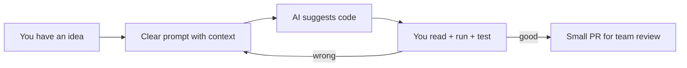

# Vibe Coding with GigDash

**Vibe coding** means describing what you want in plain language and pairing with an AI assistant (Cursor, GitHub Copilot, Replit AI, ChatGPT, etc.) to produce working code — then **you** verify, test, and commit it responsibly.

This is not cheating. It's a skill: like using a calculator in math class, the tool is only useful if you understand the result.

---

## The mindset



You are still the developer. AI is a fast intern who sometimes hallucinates file paths.

---

## Golden rules (team agreement)

1. **One feature per branch** — don't let AI refactor the entire repo in one chat.
2. **Name files you care about** — "Edit `FanHome.tsx` only" beats "improve the app."
3. **Run `pnpm run typecheck`** before every PR.
4. **Never commit `.env`** or paste `DATABASE_URL` into chat.
5. **Read the diff** — if you can't explain a change, don't merge it.
6. **Pull `main` before starting** — AI trained on old code causes duplicate work.

---

## Best tools for this repo

| Tool | Strength on GigDash |
|------|---------------------|
| **Cursor / VS Code + Copilot** | Edits multiple files, sees whole repo |
| **Replit AI** | Great when you deploy on Replit |
| **GitHub Copilot** | Inline completions in TypeScript/React |

Open the **`docs/`** folder in the same workspace so you can `@`-mention guides in Cursor.

---

## How to write a great prompt

### Bad prompt

> make the app better

### Good prompt

> In `lib/gigdash/src/pages/FanHome.tsx`, add a "Tonight only" toggle that filters events to `eventDate` on the current calendar day. Use the existing `useListEvents` hook. Match emerald fan styling. Do not change `openapi.yaml` unless the API lacks a date filter — if it does, tell me first.

### Prompt template (copy and fill in)

```text
Project: GigDash monorepo (React + Express + Drizzle + OpenAPI codegen)

Goal: [one sentence]

Files to touch: [exact paths]

Constraints:
- Match existing Tailwind / shadcn patterns
- Use generated hooks from @workspace/api-client-react
- Do not edit generated files in api-client-react/src/generated/
- Run typecheck when done

Out of scope: [what NOT to change]
```

---

## Vibe coding workflows by task type

### Frontend-only (safest for beginners)

**Example:** Add a footer to the landing page.

```text
Edit only lib/gigdash/src/pages/Home.tsx.
Add a simple footer with links to /login and /signup.
Use existing text-foreground and border-border classes.
```

No API or database changes → low risk of team conflicts.

---

### Frontend + existing API

**Example:** Show event pay amount on the fan list.

```text
In FanHome.tsx, display payAmount from EventSummary when isPaid is true.
The type already exists in api-client-react generated schemas.
Do not modify openapi.yaml.
```

Check generated types in `lib/api-client-react/src/generated/api.schemas.ts`.

---

### Full-stack feature (coordinate with a teammate)

**Example:** Let fans save favorite venues.

Order matters:

1. **Database** — add table or column in `lib/db/src/schema/`
2. **OpenAPI** — new endpoints in `lib/api-spec/openapi.yaml`
3. **Codegen** — `pnpm --filter @workspace/api-spec run codegen`
4. **API routes** — implement in `lib/api-server/src/routes/`
5. **UI** — use new hooks in `lib/gigdash`

```text
We need POST /api/fans/me/favorites and GET to list them.
Start with openapi.yaml paths and schemas only.
Wait for my approval before implementing routes.
```

Split steps across PRs if your class requires small reviews.

---

## Talking to AI about this codebase

### Always mention

- Package names: `@workspace/gigdash`, `@workspace/api-server`
- That API hooks are **generated**
- Auth uses **express-session** (cookies), not JWT in localStorage
- Maps use **react-leaflet** in `components/fan/MapView.tsx`

### Never paste

- Real `DATABASE_URL` or passwords
- `SESSION_SECRET` from production
- Classmates' personal data

Use placeholders: `DATABASE_URL=postgresql://...`

---

## Reviewing AI output (checklist)

Before `git add`:

- [ ] Did it create duplicate components instead of reusing `components/ui/`?
- [ ] Did it edit `generated/api.ts`? (Revert and run codegen.)
- [ ] Did it use `fetch('/api/...')` instead of generated hooks?
- [ ] Do new strings match role colors (amber / violet / emerald)?
- [ ] Does `pnpm run typecheck` pass?
- [ ] Did you click through the feature in the browser?

---

## When AI breaks things

| Symptom | Fix |
|---------|-----|
| Red squiggles in import from `@workspace/api-client-react` | `pnpm install` then codegen if spec changed |
| 404 on API | Route missing in `api-server/src/routes/index.ts` |
| Blank map | Check Leaflet CSS import in `main.tsx`; check event coordinates in seed data |
| Login loop | API not running; `credentials: 'include'` on fetch (handled in `custom-fetch.ts`) |

**Undo strategy:** `git checkout -- path/to/file` or discard the whole branch and start fresh. That's why we use branches.

---

## Pairing AI with GitHub

1. Create branch: `add-fan-favorites`
2. Vibe code in small chunks with commits:
   - `Add favorites table to schema`
   - `Add OpenAPI paths for favorites`
   - `Implement favorites routes`
   - `Add heart button on venue profile`
3. Open PR with screenshots + "Tested with seed user X"
4. Teammate reviews **Files changed** — not just your word

See [GitHub Collaboration](./github-collaboration.md).

---

## Example session (15 minutes)

**Goal:** Genre filter remembers last choice after refresh.

1. Open `FanHome.tsx` and preview in browser.
2. Prompt: "Store selectedGenre in localStorage key `gigdash-fan-genre`, read on mount, default All."
3. Run app — switch genre, refresh — confirm it sticks.
4. `pnpm run typecheck`
5. Commit: `Persist fan genre filter in localStorage`
6. Push branch, open PR.

---

## For teachers / captains

Encourage students to paste in PR descriptions:

- What they asked the AI
- What they changed manually after review
- Screenshot or short screen recording

That documents learning, not just output.

---

**Next:** [GitHub & Team Workflow](./github-collaboration.md) — ship your vibe-coded work safely with the squad.